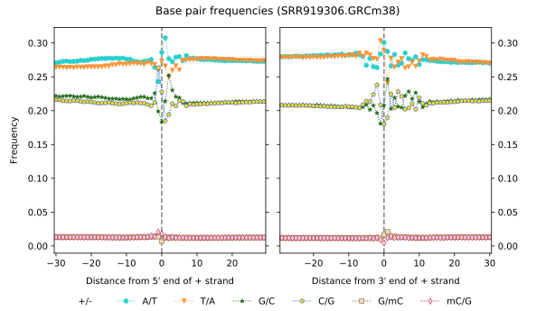
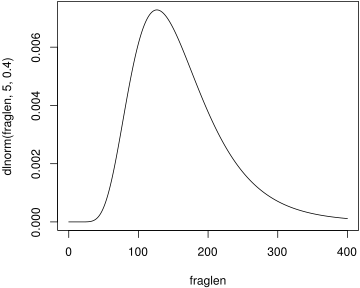
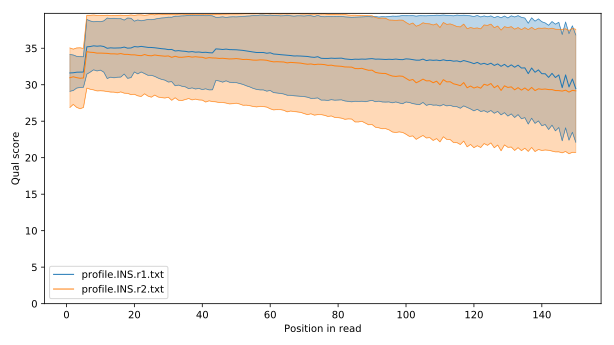
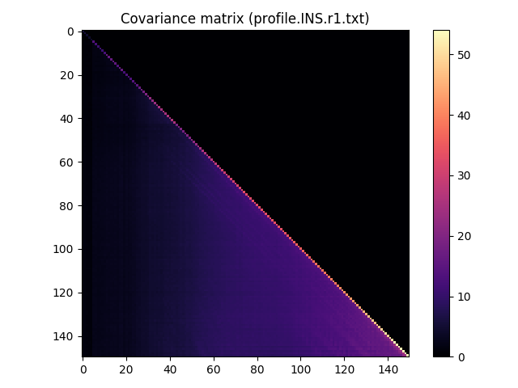
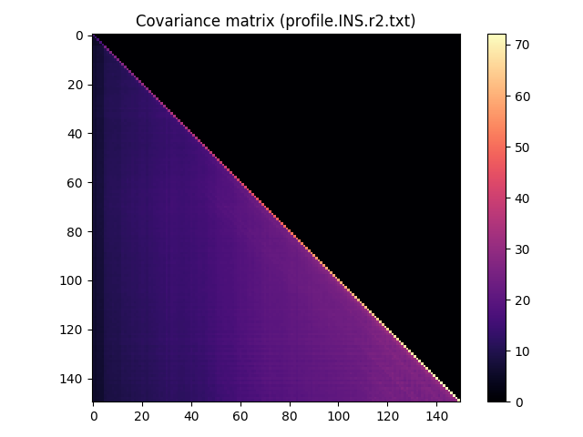

# PP5mC

PP5mC is a pre-processing toolkit for calling 5-methylcytosines (5mC),
from hairpin bisulfite sequencing (HBS-seq) data.

# Prerequisites
The core parts of PP5mC are written in C, and thus requires a C compiler
(tested with **GCC v5.5.0**).  The Slurm pipeline, and several helper scripts,
were written in **Python** (tested with **v2.7.15**).  While PP5mC was
developed and tested only on Linux, its components are expected to work
on \*BSD, MacOSX, etc., without major modifications (feedback welcome!).
The following libraries are required:

* [zlib](https://zlib.net/), used by `foldreads` for decompressing gzipped
  fastq files;
* [htslib](https://github.com/samtools/htslib), used by `scanbp` and `mark5mC`
  to parse bam files; and
* [matplotlib](https://matplotlib.org/), used by plotting scripts.

In addition, the full processing pipelines require
[BWA](https://github.com/lh3/bwa),
[samtools](http://www.htslib.org/), and
[GATK](https://software.broadinstitute.org/gatk/).

# Installation
Clone the git repository, then build with `make`.  You may wish to edit
the `Makefile` to statically link with htslib, and/or to specify its path.

# Usage
A [shell script pipeline](pipeline/) for unix workstations is provided which
implements a minimal working pipeline that:
(1) reconstructs reads with `foldreads`;
(2) aligns reconstructed reads with `bwa mem -C`;
(3) merges different libraries for the same sample;
(4) removes PCR duplicates;
(5) realigns reads around indels using `GATK`;
(6) records and plots nucleotide pairing frequencies with `scanbp`; and
(7) calls methylation status at all CpG, CHG, and CHH contexts with `mark5mC`.

The Slurm pipeline follows roughly the same stages, and is further documented
[here](slurm_pipeline/README.md).

Most of the tools included with PP5mC provide some usage information if
they are invoked without any parameters.


## Reconstructing original target molecules
The `foldreads` command attempts to "fold" input sequences back together
at the hairpin, thereby reconstructing the original sequences.  It takes two
HBS-seq FASTQ files as input, and outputs the reconstructed sequences to
``stdout`` (also in FASTQ format).
Multiple hairpin sequences may be specified (`-p`/`-P` parameters can be
specified multiple times), and `foldreads` searches for hairpins in the order
in which they are specified.

```
$ ./foldreads 
Error: must specify input files.
foldreads v12
usage: ./foldreads [...] -1 IN1.FQ -2 IN2.FQ
 -o OUT.FQ         Fastq output file [stdout]
 -m FILE           Metrics output file [stderr]
 -u PREFIX         Filename prefix for unfolded reads []
 -p SEQ            The hairpin SEQuence [ACGCCGGCGGCAAGTGAAGCCGCCGGCGT]
 -P SEQ            The hairpin SEQ (unmethylated and will be C->T converted)
 -1 IN1.FQ[.GZ]    R1 fastq input file
 -2 IN2.FQ[.GZ]    R2 fastq input file
 -T SEQ            Adapter SEQuence trailing R1 (p7) [AGATCGGAAGAGCACACG...]
 -B SEQ            Adapter SEQuence trailing R2 (p5) [AGATCGGAAGAGCGTCGT...]
```

The FASTQ file output by `foldreads` contains additional tab separated fields
in the comment section following the @\<read name\>.

```
r1:Z:<read 1 sequence>
q1:Z:<PHRED+33 quality scores for read 1>
r2:Z:<read 2 sequence>
q2:Z:<PHRED+33 quality scores for read 2>
hp:Z:<hairpin sequence specified with -p or -P that matched this read>
```

### Metrics
`foldreads` collects some statistics from the reads that it processes,
which are printed to ``stderr`` by default, or to a file if specified with
the `-m` parameter.  In particular, `foldreads` records the number of reads
processed (NR), the number of reads successfully reconstructed (NF), the
number in which the full hairpin sequence was observed (NH), the number
of occasions the hairpin was found in different positions in read 1 and
read 2 (ND), and the number of hairpins identified for each hairpin sequence
specified with `-p` or `-P`.  The metrics file is human readable, but has
been constructed to make it easy to extract fields with `awk`.


```
$ awk '/^NR/ {print $2}' SRR919306.metrics.txt
32783944
$ awk '/^NF/ {print $2}' SRR919306.metrics.txt
30441647
$ awk '/^NR/ {nreads=$2} /^NF/ {nfolded=$2} END {print nfolded/nreads}' SRR919306.metrics.txt
0.928554
```

A read length histogram is recorded in the metrics, and is also fitted to a
truncated lognormal distribution.  Observed fragment lengths are no longer
than the read length (and may be shorter if a hairpin is found, or if bases
are trimmed due to coincidental matches with a hairpin sequence), so the
distribution is truncated near the read length.  Fitting to a lognormal works
well when the fragment length distribution is not truncated by the read
length too heavily  (e.g. see ``test_fit.c``).

### Colouring reads

To diagnose the kinds of molecules that were sequenced, one generally has to
look at the raw reads.
its useful to have a
visual aid when looking at raw reads.
We provide a script, `fq2html.py`, which provides a visual aid to help
diagnose the kinds of molecules that were sequenced.  It outputs HTML or
LaTeX code that adds different colours to distinguish HBS-seq features.
The script is rather ad-hoc, but very useful.  To look at the first 25
reads that were successfully reconstructed with `foldreads`, try:

```
$ fq2html.py -n 25 SRR919306.folded.fq.gz > SRR919306.folded.html
```

Which produces [this output](http://htmlpreview.github.io/?https://github.com/grahamgower/PP5mC/blob/master/extra/SRR919306.folded.html), where
**R1** and **R2** are the original reads sequenced, **FS** is the sequence
reconstructed with `foldreads`, and **FQ** are the quality scores for
reconstructed bases.  Here is a key to the font type/colour in the output:

type/colour		| feature
------------------------|--------
yellow background	| hairpin
cyan background		| adapter
dark blue text		| T/C or G/A (bisulfite converted bases)
red text		| C/C or G/G (unconverted bases)
magenta text		| mismatches, or N
underline		| base with Q<=20

If used with folded reads, `fq2html.py` looks at the extra fields in the
comment section of the FASTQ to obtain the original read 1/2 sequences,
and to determine the hairpin sequence to be coloured.  But reads that
have not been folded can also be coloured.  In this case, the hairpin
sequence needs to be specified (for the data from Zhao et al., the hairpins
are unmethylated, so the `-u` flag was used).

```
$ fq2html.py -n 25 -u -p ACGCCGGCGGCAAGTGAAGCCGCCGGCGT SRR919306.unfolded_r1.fq SRR919306.unfolded_r2.fq > SRR919306.unfolded.html
```

The output from [reads which could not be folded](http://htmlpreview.github.io/?https://github.com/grahamgower/PP5mC/blob/master/extra/SRR919306.unfolded.html)
show large numbers of mismatches, and may indicate non-canonical HBS-seq
molecules, such as adapter dimers or molecules with Y-adapters ligated
to both ends.


## Read alignment and optional SAM fields.
Reads are aligned using `bwa mem -C`.
The [BWA manual](http://bio-bwa.sourceforge.net/bwa.shtml) states the
following about using the `-C` flag:
```
-C 	Append FASTA/Q comment to SAM output. This option can be used to
	transfer read meta information (e.g. barcode) to the SAM output. Note
	that the FASTA/Q comment (the string after a space in the header line)
	must conform the SAM spec (e.g. BC:Z:CGTAC). Malformated comments lead
	to incorrect SAM output. 
```

We note that `bwa aln` contains no equivalent flag, however we have submitted
a [pull request](https://github.com/lh3/bwa/pull/203) to add this feature.
After being transferred into the SAM/BAM file by `bwa mem -C`, the additional fields
are used by `scanbp` and `mark5mC`.


## M-bias plots
Because HBS-seq produces observations for both the top and bottom strands of
target molecules, we take advantage of the additional information when creating
M-bias plots.  These plots are used to look at the frequency of methylation
calls as a function of read position, and can indicate library artefacts
such as ligation bias.  The `scanbp` command uses the read pileup to record
the frequency of different nucleotide pairs at each position within reads,
as well as positions upstream and downstream of where the read mapped.

```
$ ./scanbp SRR919306.GRCm38.bam > SRR919306.ntpairs.txt
$ ./plot_nt_pairing.py --title "SRR919306.GRCm38" SRR919306.ntpairs.txt SRR919306.ntpairs.pdf
```



## Methylation calling
Regular BS-seq tools are not directly usable for methylation calling from
HBS-seq data, so we provide the `mark5mC` command to do this.  From a visual
inspection of the nucleotide pairing plots, one can identify how many bases
at each end of the reads where methylation calls may not be trustworthy, and
specify their exclusion with `-5` and `-3` parameters to `mark5mC`.

```
$ ./mark5mC -5 10 -3 10 SRR919306.bam GRCm38.fasta | gzip -c - > methlist.txt.gz
```

The output file is a (bed compatible) tab separated file, indicating the
``depth``, and number of ``C``/``mC`` observations, and the
``strand``/``context`` for the observations.  The ``C`` and ``mC`` columns
may not sum to the ``depth``, due to heterozygosity or differences between
the reference and the sequenced individual.
```
$ zcat methlist.txt.gz | head
chrom   pos-0   pos-1   strand  depth   C       mC      context
chr1    3000241 3000242 +       1       1       0       CAT
chr1    3000244 3000245 +       1       1       0       CCA
chr1    3000245 3000246 +       1       1       0       CAG
chr1    3000247 3000248 -       1       1       0       CTG
chr1    3000248 3000249 -       1       1       0       CCT
chr1    3000253 3000254 +       2       2       0       CCT
chr1    3000254 3000255 +       2       2       0       CTG
chr1    3000256 3000257 -       2       2       0       CAG
chr1    3000257 3000258 -       2       2       0       CCA
```

This list of methylation calls can be converted to the
[pileOmeth](https://github.com/dpryan79/MethylDackel) format, or the
[methylkit](https://github.com/al2na/methylKit) format,
using the `frobmethlist.py` script provided.

## Simulating HBS-seq reads

The `simhbs` command can be used to simulate HBS-seq or regular BS-seq
reads, from a specified FASTA reference sequence.

```
$ ./simhbs 
simhbs v1
usage: ./simhbs [...] ref.fa
 -b FLOAT       Bisulfite conversion rate [0.980]
 -e FLOAT       Sequencing error rate [0.001]
 -E FILE1,FILE2 Empirical error profiles, from `qualprofile'
                  FILE1 specifies the profile for read 1, FILE2 for read 2
 -m {bs,hp,pal} Molecule type to simulate, one of:
                  bs - regular MethylC-seq [default]
                  hp - hairpin-bisulfite seq
                  pal - Star et al. (2014) palindromes, bisulfite treated
 -n INT         Number of sequences to simulate [100]
 -o STR         Output prefix for fastq files [simhbs]
 -r INT         Read length [150]
 -s FLOAT       std.dev. of LogNormal molecule length [0.250]
 -u FLOAT       mean of LogNormal molecule length [4.000]
```

For example, to simulate 10000 HBS-seq reads from the human genome,
using a flat sequencing error rate of 0.2% per base, a 99% bisulfite conversion
efficiency, a 100 bp read length, and a lognormal(mu=5.0, sigma=0.4)
fragment length distribution:

```
$ ./simhbs -b 0.99 -e 0.002 -m hp -n 10000 -r 100 -u 5.0 -s 0.4 GRCh38.chr15.fasta
```

An easy way to decide on appropriate parameters for the lognormal length
distribution of the underlying target molecules, is to plot the distribution.
E.g., using R to plot the default fragment length distribution:
```
R> fraglens=0:400
R> plot(fraglens, dlnorm(fraglens, 5.0, 0.4), "l")
```

Which produces the following plot:



### Quality score profiles

A flat error rate is not overly realistic.  `simhbs` can also be used with
empirical error profiles.  To generate a profile, we provide the
`qualprofile` command, which records the mean quality scores at each position
in the reads, and the covariance matrix, for a given FASTQ.
Sufficient accuracy does not require a large number of reads,
so `qualprofile` is hard coded to exit after 100000 reads.
Separate profiles should be created for read 1 and for read 2.

```
$ ./qualprofile illumina-nextseq-r1.fastq.gz > profile.INS.r1.txt
$ ./qualprofile illumina-nextseq-r2.fastq.gz > profile.INS.r2.txt
```

The profiles can be plotted to show the mean quality
scores along the reads, with ribbons representing one standard deviation
either side of the mean, and heatmaps showing the covariance of quality
scores in different positions.
```
$ ./plot_qualprofile.py profile.INS.pdf profile.INS.r1.txt profile.INS.r2.txt
```






The `-E` parameter to `simhbs` can be used to simulate quality scores by
sampling from a multivariate normal distribution for each read
(with means and covariance matrix as recorded by `qualprofile`).
Sequencing errors (single base substitutions) are then added, with the
probability of error determined by the the quality score.
